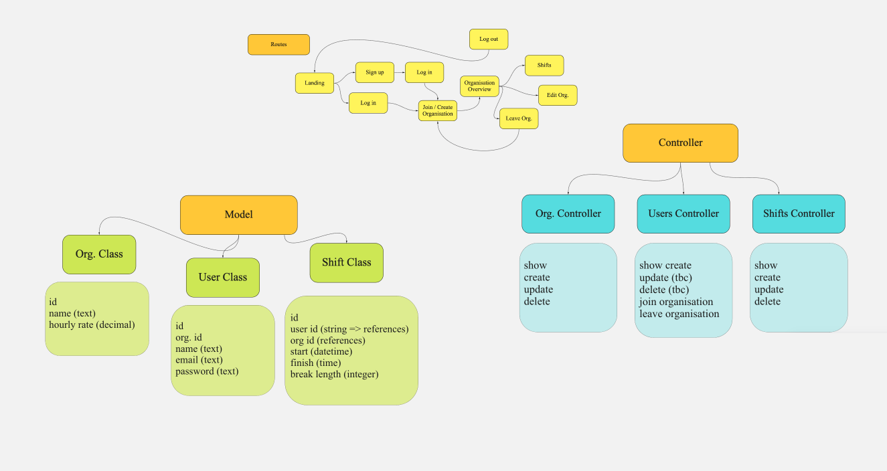

Shift Space
==================

```
        _...._
      .'      '.      _           _______ ______
     /     .-""-\   _/ \        _/       Y      \_     
   .-|    /:.   |  |   |       // Rails  | Shift \\
   |  \   |:.   /.-'-./       //   App   |  Sapce \\ 
   |  .-'-;:__.'    =/       //_________.|.________\\   
   .'=  *=|NASA _.='        `-----------`-'----------'
  /   _.  |    ;
 ;-.-'|    \   |
/   | \    _\  _\
\__/'._;.  ==' ==\
         \    \   |
         /    /   /
         /-._/-._/
         \   `\  \
          `-._/._/
            
```
______
  
[Planning](#Planning) | [Set up](#Setup) | [DB Connection](#DB) | [Interact](#Interact) | [Run Tests](#Tests) | [User Stories](#User-Stories) | [Technologies](#Tech)

This project is a simple programme that keeps track of your work shifts. Users can signup, login, create new organisations for their team to join and imput their shifts. Evert user is able to edit and delete an organisation. Once joined they are part of the organisation until they leave it. Users can edit or delete their own shifts in the table manually, others do not have access to do so.
  
<!-- This app is deployed on [Heroku](https://whispering-woodland-40745.herokuapp.com/). -->

## <a name="Planning">Planning & Domain Model</a>

Before starting my project I have created a Miro board to structure my databases and controllers.

<!--  -->
<div align="left"> 
   </a> 
<div>
  
## <a name="Setup">Set up</a>

1. **Fork** this [Shift Space repository](https://github.com/CorinneBosch/shift-space/) 
2. Then clone **your** fork to your computer.
3. Ensure you have `Ruby` and `rspec` installed. Check ruby version with `ruby -v`
4. Ensure you have Node.js installed on your machine as the JavaScript runtime. Check node version with node -v
5. Install bundler if you haven't already. `gem install bundler`
6. Install the gems required by this repository. `bundle install`
7. You might need to add webpacker before starting the server. `yarn add webpacker`

## <a name="DB">DB Connection</a>

Before running the application on localhost, please migrate the database.\
If you wish to seed your db you can do so with the 2nd command.

```
rails db:create
rails db:migrate
rails db:seed
```
  
## <a name="Interact">Interact with the programme</a>

Open the application in your directory with `rails server`

Direct in your browser to `http://localhost:3000`.\
Now you can register on Shift Space and browse through and keep track of your Team's shifts!

## <a name="Tests">Run tests</a>

To test all units and features at once in your terminal.\
Print out the format documentation with the -fd shortcut.
```
$ rspec
$ rspec -fd
```

To test inividual controller or feature tests in your terminal:
```
$ rspec spec/controllers/shifts_controller_spec.rb -fd
$ rspec spec/features/user_can_login.rb -fd
```

## <a name="User-Stories">User stories & criteria</a>

<!-- Find all user stories & tickets on this [Trello Board](https://trello.com/b/aN3xtXXl/acebook-rails-template).\ -->
<!-- The Acebook project criterias can be found [here](https://github.com/makersacademy/course/blob/main/final_projects/project_criteria.md). -->
 
## <a name="Tech">Technologies used</a>
  
- Framework: Ruby on Rails
- Database: ActiveRecord, ActiveStorage
- Testing: RSpec and Capybara
- Linting: Rubocop
- Other: jQuery
<!-- - Deployment: Heroku -->
<!-- - Business tools: Miro, Trell -->

